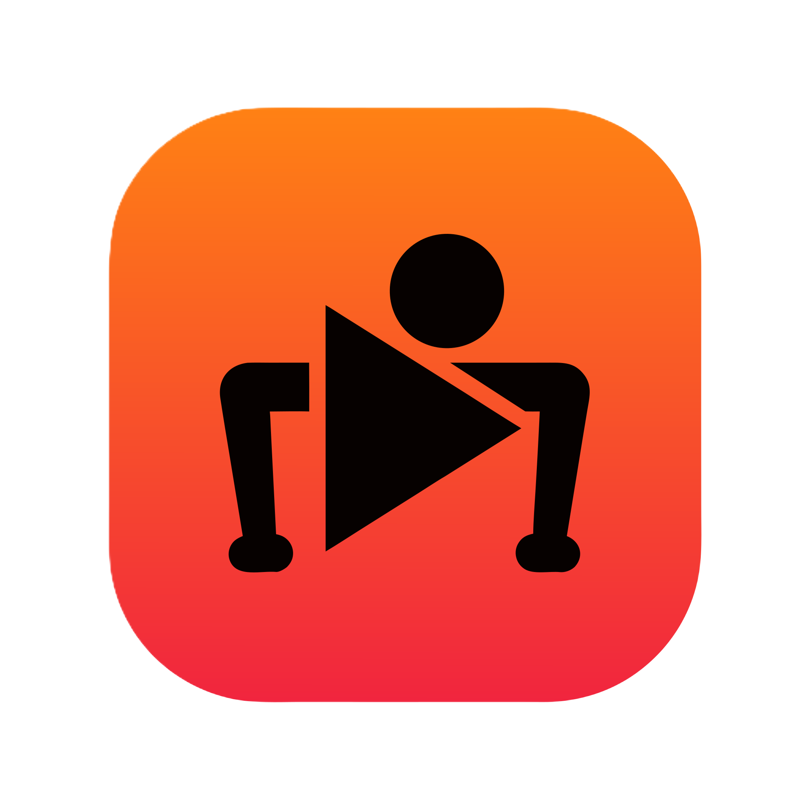
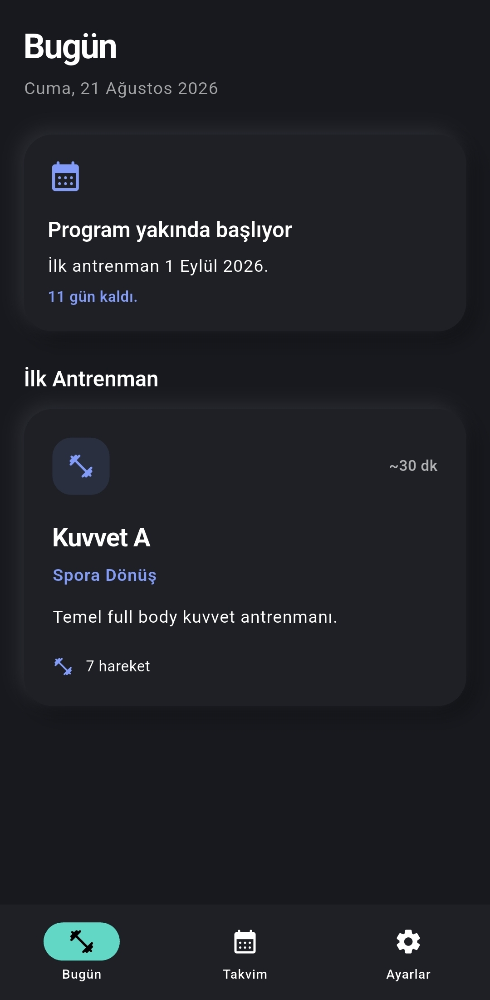
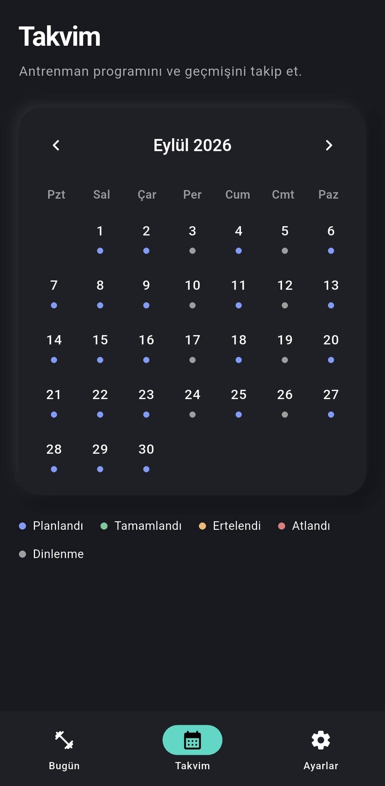

<div align="center">



# Fitness Tracker

**Ekipmansız kuvvet antrenmanlarını ve koşu programını takip etmek için geliştirilmiş kişisel Flutter uygulaması.**

Android • Offline • Flutter

</div>

---

## 📱 Proje Hakkında

Fitness Tracker, evde ekipmansız yapılan kuvvet antrenmanlarını ve koşu programını tek bir yerden takip etmek amacıyla geliştirdiğim kişisel bir Android uygulamasıdır.

Uygulamanın temel amacı karmaşık fitness platformları yerine günlük olarak yalnızca gerekli bilgiyi göstermek:

- Bugün hangi antrenmanın yapılacağı
- Antrenmandaki hareketler ve hedefler
- Koşu planı
- Tamamlanan, atlanan ve ertelenen günler
- Gelecek antrenman programı
- Günlük antrenman hatırlatıcıları

Tüm veriler cihaz üzerinde tutulur. Hesap oluşturma, sunucu, bulut senkronizasyonu veya internet bağlantısı gerektirmez.

---

## 🖼️ Ekran Görüntüleri

<div align="center">


&nbsp;&nbsp;&nbsp;


</div>

> Ekran görüntüleri uygulamanın güncel Android sürümünden alınmıştır.

---

## ✨ Özellikler

### Günlük Antrenman

Ana ekran o gün yapılması gereken antrenmanı gösterir.

Kuvvet antrenmanlarında:

- Hareket listesi
- Set ve tekrar hedefleri
- Hareket açıklamaları
- Progression seçenekleri
- Antrenman ilerlemesi

Koşu günlerinde:

- Easy Run
- Interval Run
- Tempo Run
- Long Easy Run

gibi antrenman türleri için adım adım koşu planı gösterilir.

---

### ✅ Antrenman Takibi

Antrenman sırasında hareketler veya koşu adımları tek tek tamamlandı olarak işaretlenebilir.

İlerleme cihaz üzerinde saklandığı için uygulamadan çıkılsa bile devam eden antrenman kaybolmaz.

Tüm hareketler tamamlandıktan sonra antrenman tamamlanabilir.

---

### 📅 Takvim

Aylık takvim üzerinden geçmiş ve gelecek program görüntülenebilir.

Antrenman günleri farklı durumlarla takip edilir:

- Planlandı
- Tamamlandı
- Atlandı
- Ertelendi
- Dinlenme günü

Takvim yalnızca önceden oluşturulmuş birkaç ayla sınırlı değildir. Gerektiğinde ileri tarihler için program otomatik olarak oluşturulur.

---

### ⏭️ Atla ve Ertele

Bir antrenman yapılamayacaksa iki farklı seçenek bulunur.

**Atla**

Antrenman atlandı olarak işaretlenir ancak gelecekteki program değişmez.

**Ertele**

Antrenman bir sonraki güne taşınır ve o tarihten sonraki program, dinlenme günleri dahil olmak üzere bir gün ileri kaydırılır.

Bu sayede programın sırası korunur.

---

## 🏋️ Antrenman Programı

Program **1 Eylül 2026** tarihinde başlar.

İlk dönem Eylül 2026 ile Ocak 2027 arasında kademeli olarak ilerler:

**Spora Dönüş → Temel Kuvvet ve Kondisyon → Performans → Atletik Dönem → Konsolidasyon**

Ocak 2027 sonunda program bitmez.

Sonrasında sürdürülebilir bir **4 haftalık antrenman döngüsü** devam eder.

Genel haftalık yapı:

| Gün | Antrenman |
| --- | --- |
| Pazartesi | Kuvvet A |
| Salı | Easy Run |
| Çarşamba | Kuvvet B |
| Perşembe | Dinlenme |
| Cuma | Interval / Tempo |
| Cumartesi | Kuvvet C |
| Pazar | Long Easy Run |

Kalite koşuları dört haftalık döngüyle ilerler:

**Interval → Tempo → Interval → Hafif Tempo**

Dördüncü haftadan sonra döngü yeniden başlar.

---

## 🔔 Yerel Bildirimler

Uygulama günlük antrenmanlar için Android local notification sistemi kullanır.

Hatırlatma saati Ayarlar ekranından değiştirilebilir.

Bildirim sistemi programla senkronize çalışır:

- Dinlenme günlerinde bildirim gönderilmez.
- Tamamlanan antrenmanın bekleyen bildirimi kaldırılır.
- Atlanan antrenmanın bildirimi kaldırılır.
- Program ertelendiğinde gelecek bildirimler yeni tarihlere göre yeniden oluşturulur.

Bildirimler için herhangi bir uzak sunucu kullanılmaz.

---

## 🏠 Android Ana Ekran Widget'ı

Uygulamada **4×2 Android ana ekran widget'ı** bulunur.

Widget üzerinden:

- Bugünkü antrenman
- Tahmini süre
- Hareket veya koşu adımı sayısı
- Antrenman durumu
- Sıradaki antrenman

görüntülenebilir.

Program başlamadan önce widget başlangıç tarihini gösterir.

Antrenman tamamlandığında, atlandığında veya ertelendiğinde widget verileri uygulamayla senkronize edilir.

<div align="center">


</div>

---

## 🎨 Görünüm

Uygulamanın arayüzü sade bir **neumorphic tasarım dili** kullanır.

Üç farklı görünüm seçeneği bulunur:

- Sistem
- Açık Tema
- Koyu Tema

Tema tercihi cihaz üzerinde saklanır ve uygulama yeniden açıldığında korunur.

---

## 🔒 Offline ve Yerel Veri

Fitness Tracker kişisel kullanım odaklı ve local-first olarak geliştirilmiştir.

Uygulamada:

- Kullanıcı hesabı yoktur.
- Firebase yoktur.
- Backend yoktur.
- Cloud database yoktur.
- İnternet bağlantısı zorunlu değildir.

Antrenman programı, tamamlanma durumları, devam eden antrenman ilerlemesi ve uygulama ayarları cihaz üzerinde saklanır.

---

## 🛠️ Kullanılan Teknolojiler

| Teknoloji | Kullanım |
| --- | --- |
| Flutter | Mobil uygulama |
| Dart | Uygulama dili |
| Riverpod | State management |
| Hive CE | Yerel veri saklama |
| flutter_local_notifications | Android bildirimleri |
| timezone | Bildirim zamanlaması |
| home_widget | Android widget entegrasyonu |
| Kotlin | Native Android widget |
| Material 3 | Arayüz altyapısı |

---

## 🧱 Proje Yapısı

```text
lib/
├── core/
│   ├── constants/
│   ├── theme/
│   └── utils/
│
├── data/
│   ├── models/
│   ├── repositories/
│   └── seed/
│
├── features/
│   ├── calendar/
│   ├── settings/
│   ├── shell/
│   ├── today/
│   └── workout/
│
├── providers/
│
├── services/
│   ├── database_service.dart
│   ├── notification_service.dart
│   ├── schedule_service.dart
│   └── widget_service.dart
│
└── shared/
    └── widgets/
````

---

## 🚀 Çalıştırma

Projeyi klonladıktan sonra bağımlılıkları yükleyin:

```bash
flutter pub get
```

Uygulamayı bağlı Android cihaz veya emülatörde çalıştırın:

```bash
flutter run
```

Kod analizi:

```bash
flutter analyze
```

Testler:

```bash
flutter test
```

---

## 📌 Platform

Uygulama şu anda **Android odaklı** olarak geliştirilmektedir.

Android'e özel olarak:

* Local notifications
* Launcher icon
* Native home-screen widget

entegrasyonları bulunmaktadır.

---

## 🎯 Projenin Amacı

Bu proje ticari bir fitness platformu oluşturmaktan çok, kendi antrenman programımı düzenli ve mümkün olduğunca zahmetsiz şekilde takip edebileceğim bir araç geliştirmek amacıyla ortaya çıktı.

Bu nedenle uygulama özellikle:

**basitlik, çevrimdışı kullanım, program sürekliliği ve günlük kullanım kolaylığı** üzerine kuruldu.
